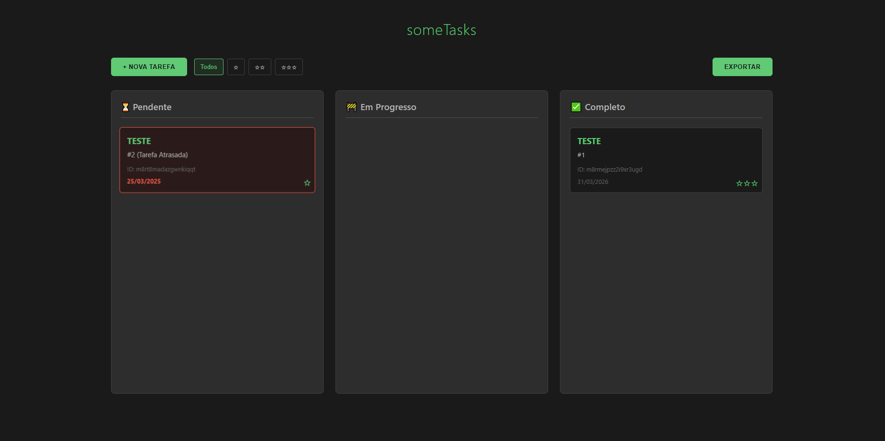

# 📋 someTasks - Gerenciador de Tarefas

Um gerenciador de tarefas moderno com arrastar/soltar, filtros inteligentes e exportação de dados. Desenvolvido com tecnologias web modernas.

## Funcionalidades

- **CRUD de Tarefas**
  - Criação com nome, descrição, status, data limite e prioridade
  - Edição dinâmica via modal
  - Exclusão com confirmação
- **Sistema de Arrastar/Soltar**
  - Movimento entre colunas (Pendente/Em Progresso/Completo)
  - Zona de exclusão com feedback visual
- **Filtragem Inteligente**
  - Filtro por nível de prioridade (☆ a ☆☆☆)
  - Visualização de tarefas atrasadas
- **Exportação de Dados**
  - Geração de arquivo CSV completo
- **Interface Moderna**
  - Design responsivo e acessível
  - Transições suaves e feedbacks visuais
  - Modais contextualizados

## Tecnologias

- **Frontend**
  - HTML5 Semântico
  - CSS3 Moderno (Grid, Flexbox, Variáveis CSS)
  - JavaScript Vanilla (ES6+)
- **Armazenamento**
  - LocalStorage para persistência de dados
- **Ferramentas**
  - (Drag & Drop, File System Access API)
  - Metodologia BEM para CSS